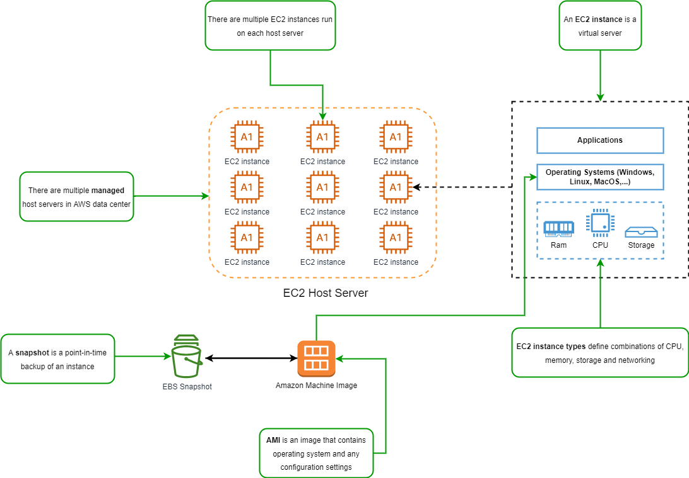

# AWS Elastic Compute Cloud (EC2)

*Elastic Compute Cloud* or *EC2* is a way that you can run virtual servers in the cloud.

Steps to launch an EC2 instance:

1. Go to **AWS management console** and choose **launch** to launch an EC2 instance.
2. Select an **instance type** to define the hardware profile and the cost.
3. Choose **Amazon Machine Image** or create a **customized AMI** to define operating system and the configuration for EC2 instance.

Features of EC2:

- **Elastic computing:** You can launch hundreds or thousands of EC2 instances within a matter of minutes.
- **Complete control:** You have full administrative / root acess to EC2 instances. You have full scope of management, thus you can configure EC2 instances however you want.
- **Flexible:** You get a choice of different instance types, operating systems, and software packages that can come preinstalled.
- **Reliable:** EC2 offers very high levels of availability and EC2 instances can be rapidly commissioned and replaced.
- **Secure:** EC2 is fully integrated with Amazon VPC and security features.
- **Inexpensive:** EC2 is fairly low cost and you only pay for what you use.