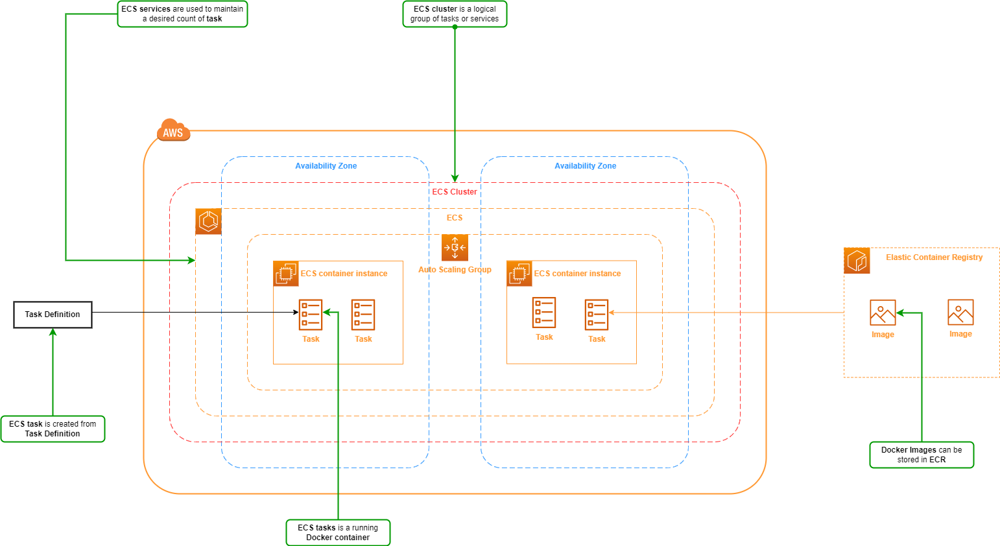

# Elastic Container Service (ECS)

## Overview

*Elastic Container Service* or *ECS* is a service that we use for managing containers in AWS.

*ECS* key features:

- **Serverless with AWS Fargate:** A form of *ECS* that AWS manage underlying infrastructure automatically for you (good for scaling because you don't need to manage underlying layer and worry about capacity management).
- **Fully managed container orchestration:** The control plane is fully managed for you (you don't have to build or manage a control plane or control nodes or anything like that).
- **Docker support:** *ECS* has full support for Docker containers.
- **Windows container support:** *ECS* supports management of Windows containers.
- **Elastic Load Balancing integration:** *ECS* can be integrated with *ELB*, *ALB* and *NLB*, thus you can distribute the traffic that comes into your application.
- **ECS Anywhere:** Enable the use ECS control plane to manage on-prem implementations.