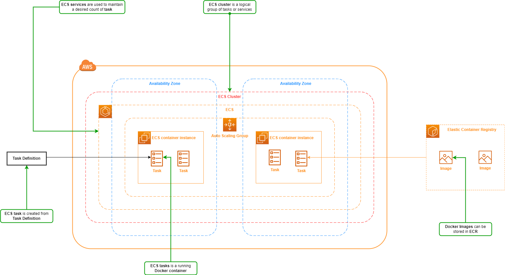
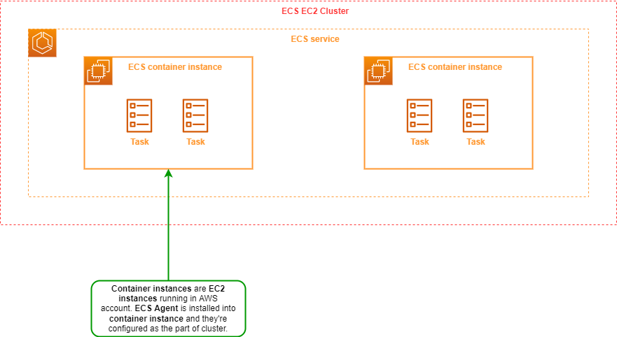
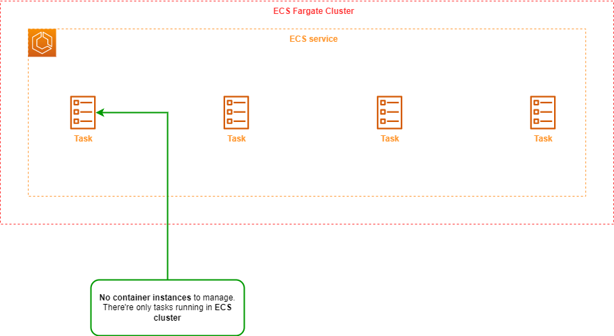

# Elastic Container Service (ECS)

## Overview

*Elastic Container Service* or *ECS* is a service that we use for managing containers in AWS.

*ECS* key features:

- **Serverless with AWS Fargate:** A form of *ECS* that AWS manage underlying infrastructure automatically for you (good for scaling because you don't need to manage underlying layer and worry about capacity management).
- **Fully managed container orchestration:** The control plane is fully managed for you (you don't have to build or manage a control plane or control nodes or anything like that).
- **Docker support:** *ECS* has full support for Docker containers.
- **Windows container support:** *ECS* supports management of Windows containers.
- **Elastic Load Balancing integration:** *ECS* can be integrated with *ELB*, *ALB* and *NLB*, thus you can distribute the traffic that comes into your application.
- **ECS Anywhere:** Enable the use ECS control plane to manage on-prem implementations.

## ECS Launch Types

*ECS* has two types;

- *ECS* with EC2 launch type.
- *ECS* with Fargate launch type.

### ECS EC2 Launch Type

*ECS* with EC2 launch type:

- You must provide EC2 instances explicitly and configure them to be part of the cluster. EC2 instances must be running the *ECS agent*.
- You're responsible for managing EC2 instances (patch management, operational control, security hardening...).
- You get charged per each running EC2 instance (i.e.you're not paying per task or container that's running, you're paying for the hosts that containers running on top of).
- *ECS* with EC2 launch type supports *Docker volumes*, *EFS* and *FSx for Windows File Server*.
- You must handle cluster optimization. You need to configure the service which defines how many tasks you want running and manage the number of ECS container instances that are running to make sure that you have enough capacity to service your containers.
- You get more granular control of your infrastructure with the EC2 launch type, but there is a cost to that in terms of operational overhead.

### ECS Fargate Launch Type

*ECS* with Fargate launch type:

- Fargate automatically provision the resources including the compute resources needed to run your tasks, and that will scale automatically for you.
- You don't need to worry about provisioning and the underlying container instances.
- You get charged per each running task (i.e. you're not paying for container instance, you're paying for running container).
- *ECS* with Fargate launch type supports only *EFS*.
- Fargate will handle all cluster optimization.
- You have limited control because infrastructure is managed automatically for you.
