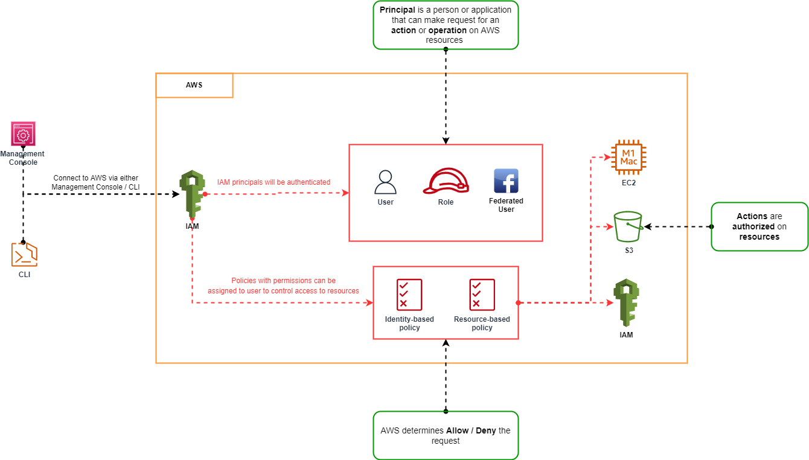

# IAM Notes

## IAM Overview

*IAM* is the identity and access management service, and is a way that we can authenticate and be authorized to access services on AWS.

## IAM Users, Groups, Roles and Policies