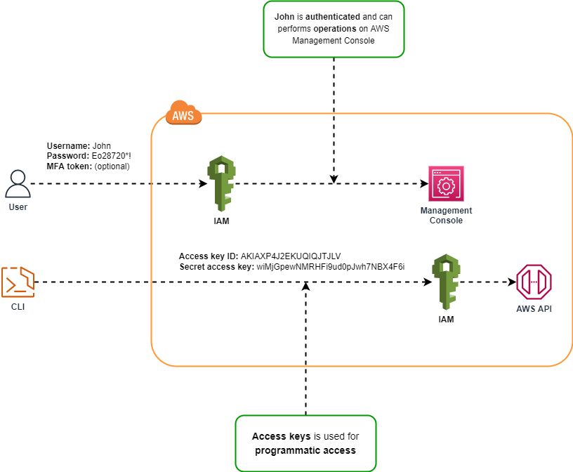

# IAM Notes

## IAM Overview

*IAM* is the identity and access management service, and is a way that we can authenticate and be authorized to access services on AWS.

## IAM Users, Groups, Roles and Policies

## IAM Authentication Methods

IAM has two authentication methods:

1. Authentication through AWS Management Console by using **username** and **password**.

2. Authentication through programmatic access by using **Access key ID** and **Secret access key**.

## IAM Security Token Service (STS)

